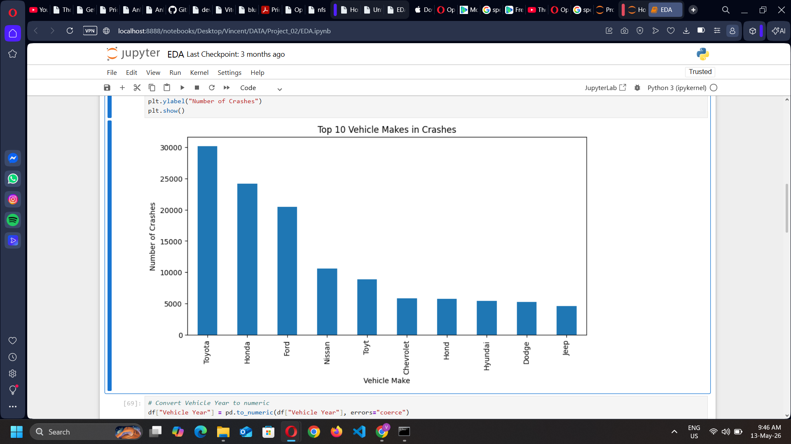
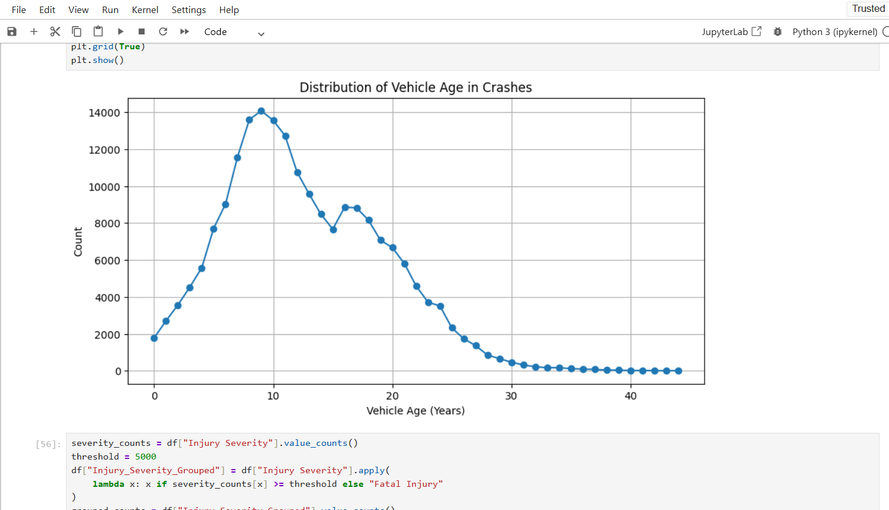
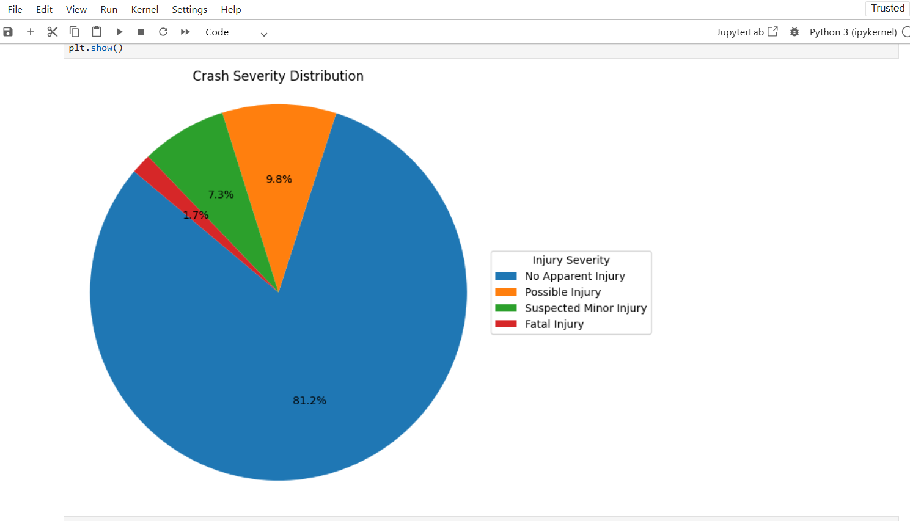

# Road-Crash-Data-Analysis
This project analyzes road crash data to identify patterns in accident frequency, injury severity, and high-risk time periods. The goal is to derive actionable insights that can help improve road safety and decision-making.

## 🎯 Objectives

- Analyze crash trends by day, time, and severity

- Identify high-risk periods for accidents

- Clean and standardize messy real-world data

- Build a dashboard for interactive analysis

## 🛠️ Tools & Technologies

- Python (Pandas, Matplotlib)

- Exel

 ## 📊 Dataset

- Contains 100,000+ crash records

- Includes:

  - Crash Date

  - Injury Severity

  - Vehicle Type

  - Location data
 
## 🧹 Data Cleaning Process

- Removed duplicate records

- Handled missing/null values

- Standardized inconsisitent text data(eg. upper/lower case issues)

- Converted object columns into:
  - Datetime (Crash Date)
  - Numeric types
  - Categorical variables 
- Grouped low-frequency categories into "Other" for better visualization

## 📈 Exploratory Data Analysis (EDA)

- Crashes by day of week

- Crash distribution by injury severity

- Peak crash hours

- Category-wise analysis of vehicle types

## 📊 Screenshots

## 🔍 Key Insights

- Majority of crashes resulted in No Apparent Injury

- Higher crash frequency observed on specific weekdays

- Peak accident hours identified during high traffic periods
  
- Certain vehicle categories are more prone to crashes

## 🚀 How to Use

1. Open the Jupyter Notebook

2. Use slicers to filter data

3. Analyze KPIs and charts

## 💡 Future Improvements

- Add SQL integration for data querying

- Automate data pipline

- Include grospatial analysis

## 👤 Author

- Vincent Bardekar
